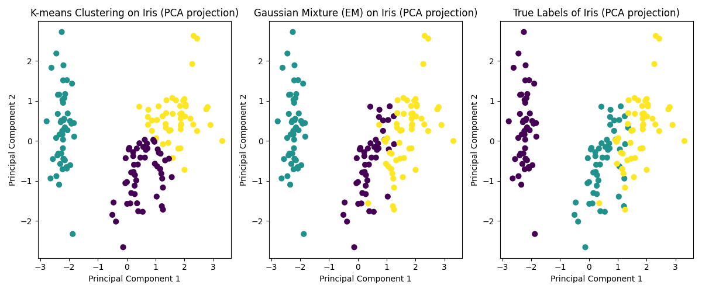

# EM-algo-test

The [Code](EM-km.py) file compares The Expectation-Maximization for Mixture fo Gaussian and the K-means algorithm, on convergence speed and accuracy.

You can find information on the dataset here [Iris Dataset Information](iris).

## EM GMM and K-means comparaisons

We use the scikit-learn librairy to implement both K-means and GMM. And use ARI and NMI to compare them.

## how to run

If you have issues running the code, it may be because your python doesn't trust the HTTPS certificate from the archive's website, to fix run this command in your terminal :

/Applications/Python\ 3.13/Install\ Certificates.command

You'll also have to install the ucimlrepo, to do this run this command in your terminal:

pip install ucimlrepo

## Results

=== K-means ===
ARI: 0.6201
NMI: 0.6595

=== Gaussian Mixture (EM) ===
ARI: 0.9039
NMI: 0.8997

You will find the results of both algorithm here : [Result](iris_clusters_sklearn.csv)

You will also find the graph of clusters of both algorithm plotted by reducing dimensionality with PCA here :

## Analysis
